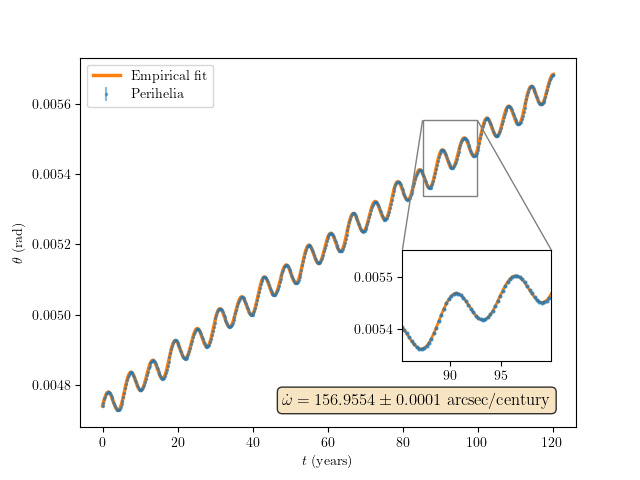
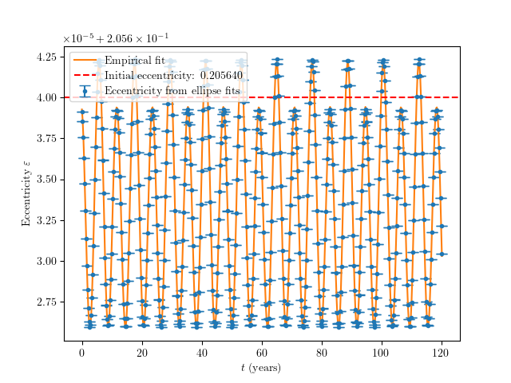
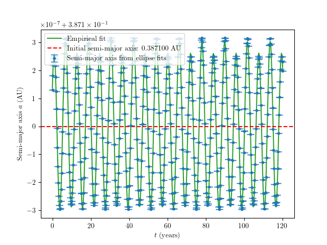

# Mercury's Precession Due to Jupiter

A numerical simulation of the three-body problem (Sun–Mercury–Jupiter) that reproduces Mercury's orbital precession caused by Jupiter's gravitational perturbation.

## Abstract

We estimate the precession of Mercury's orbit due to Jupiter's gravitational perturbation by numerically integrating the three-body problem (Sun–Mercury–Jupiter) using the Euler–Cromer method, extracting orbital elements via ellipse fitting at each perihelion passage. After compensating for the numerical precession of the integration scheme—calibrated via a two-body control run—we obtain

$$\dot\omega = 156.9554 \pm 0.0001 \;\text{arcsec/century}$$

This agrees completely with the theoretical value of $156.94''$/century for this simplified model (circular Jupiter orbit, coplanar 2-D geometry) computed by Stewart [5], and our simulation obtains a greater precision. The accepted value of the real precession is $152.6''$/century. We also characterise the synodic oscillations in eccentricity and semi-major axis and explain the observed offset between the mean perturbed eccentricity and the unperturbed value.

## Quick Start

### Prerequisites

- Python 3.9+
- A LaTeX distribution (optional, for rendering plot labels)

### Installation

```bash
git clone https://github.com/saul-diaz-mansilla/mercury-precession-jupiter.git
cd mercury-precession-jupiter
pip install -r requirements.txt
```

### Run the simulation

```bash
python code/main_simulation.py
```

This will:
1. Run a two-body calibration (M_J = 0) to measure the numerical bias of the integrator.
2. Run the full Sun–Mercury–Jupiter simulation over 500 Mercury periods (~120 years).
3. Fit orbital elements at each perihelion and produce the figures in `figures/`.

Typical runtime is ~2 minutes, depending on hardware (Numba JIT compilation dominates the first run).

## Final Report

The full write-up, including theory, methodology, and discussion of results, is available as a compiled PDF:

**[📄 report.pdf](report.pdf)**

The LaTeX source and bibliography are in the [`latex/`](latex/) directory.

## Results Gallery

### Perihelion Precession

The perihelion angle θ grows linearly (secular precession) with superimposed synodic oscillations at the Mercury–Jupiter synodic period (~5.93 years). The inset shows the quality of the empirical fit at late times.



### Eccentricity Evolution

Jupiter's perturbation induces periodic oscillations in Mercury's instantaneous eccentricity. The mean value is shifted slightly below the unperturbed eccentricity—a physical "dressing" effect, not a numerical artefact.



### Semi-Major Axis Evolution

The semi-major axis oscillates symmetrically around its initial value, as expected since it depends primarily on the total orbital energy, which is only modified at second order by the perturbation.



## Project Structure

```
mercury-precession-jupiter/
├── code/
│   ├── main_simulation.py   # Main simulation, analysis, and plotting
│   └── utils.py              # Formatting, statistics, and LaTeX utilities
├── figures/                   # Generated plots (PDF + PNG) and fit-parameter tables
├── latex/                     # LaTeX source for the report
│   ├── main.tex
│   └── biblography.bib
├── report.pdf                 # Compiled final report (for easy access)
├── requirements.txt           # Python dependencies
└── README.md
```

## References

[1] N. J. Giordano and H. Nakanishi, *Computational Physics*, 2nd ed. (Pearson Prentice Hall, 2006).
[2] H. Goldstein, C. P. Poole, and J. L. Safko, *Classical Mechanics*, 3rd ed. (Pearson, 2011).
[3] R. Fitzpatrick, *An Introduction to Celestial Mechanics* (University of Texas at Austin, 2012).
[4] R. A. Rydin, *The Theory of Mercury's Anomalous Precession*.
[5] M. G. Stewart, "Precession of the perihelion of Mercury's orbit," *Am. J. Phys.* **73**, 730–734 (2005).
